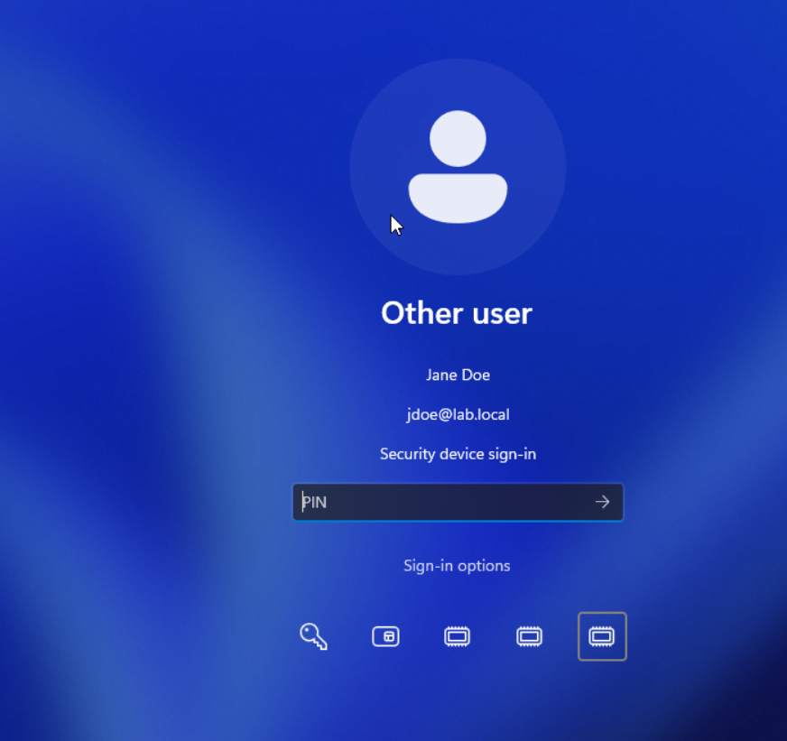
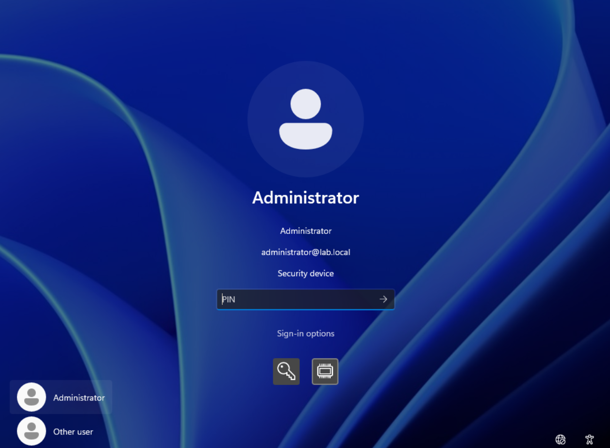
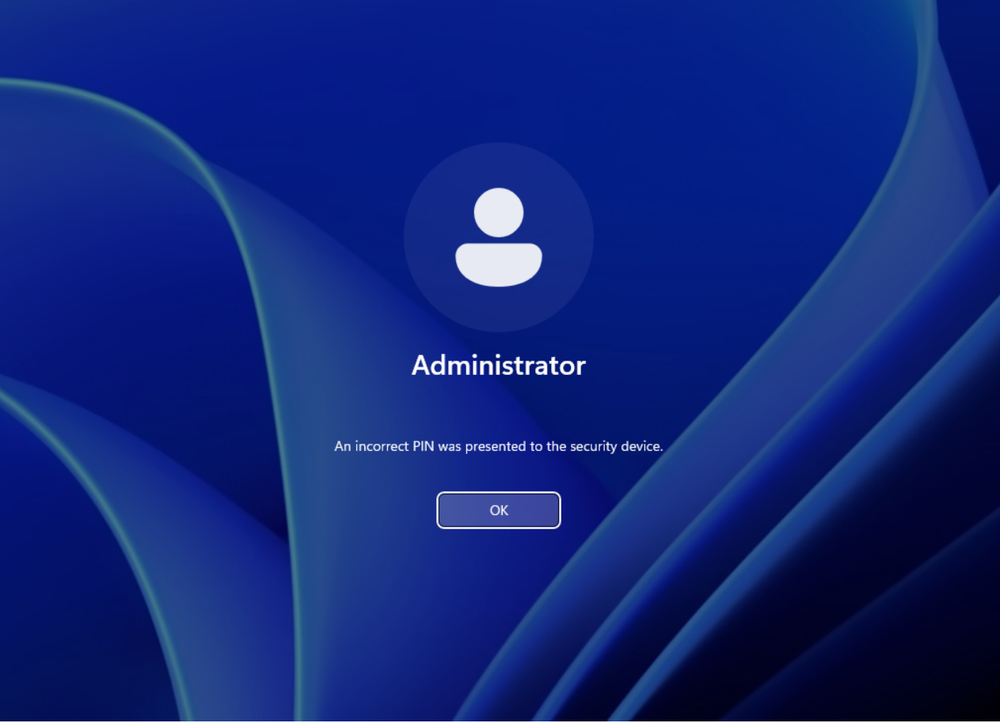
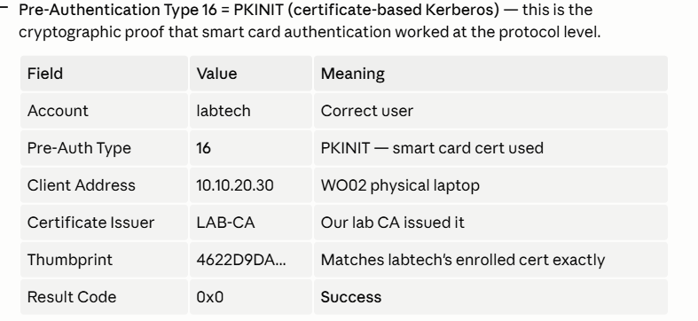
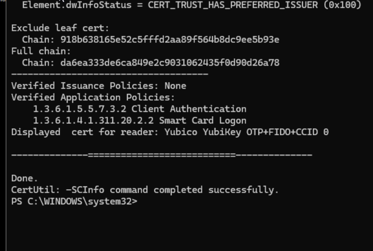
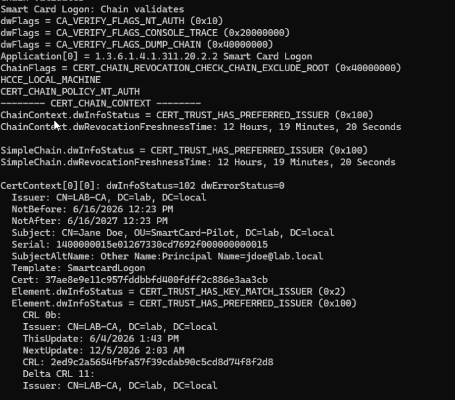
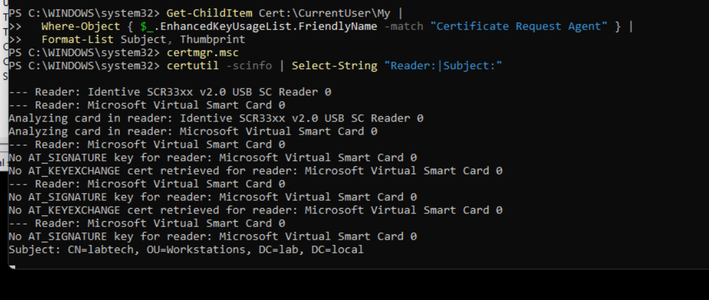
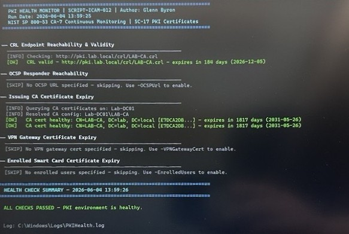
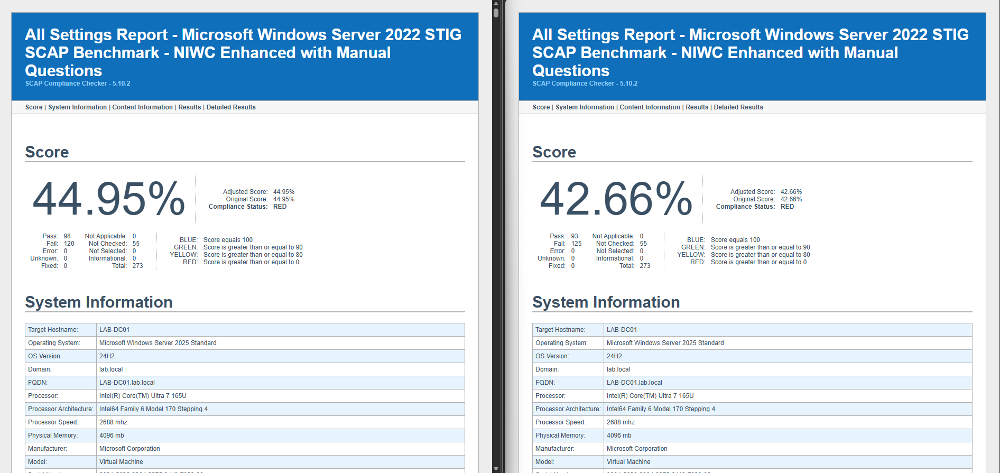
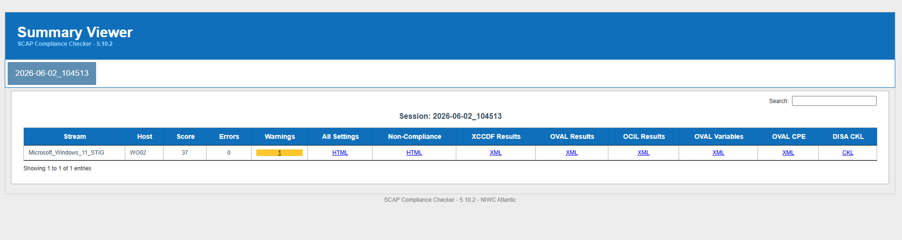

# CAC/PIV Smart Card Program — Live Demo Walkthrough

**Author:** Glenn Byron
**Document ID:** DEMO-ICAM-001
**Framework:** NIST SP 800-53 IA-2, IA-2(11), AC-11, AC-17, SC-8

> **What this covers:** A step-by-step walkthrough of the full CAC/PIV smart card flow
> as deployed by this program. Use this during a portfolio review, hiring manager demo,
> or AO briefing to show exactly what the system does and why each behavior matters.

---

## What You Are Demonstrating

This program replaces password-based logon with hardware-backed, certificate-based
authentication — the same model used by the U.S. DoD Common Access Card. The demo shows:

1. A domain workstation that **refuses to accept a password at all** — a card is required
2. Smart card logon using a **certificate on a physical token**
3. The session **locks automatically the moment the card is pulled** (< 2 seconds)
4. A **VPN that authenticates with the same certificate** — no password prompt
5. **Audit events** proving every login, logout, and certificate use is logged

The combination of #1–#4 means there is no password to phish, steal, or reuse.

---

## Prerequisites Before Running the Demo

Run `Invoke-LabValidation.ps1` and confirm all checks pass. Then verify:

- [ ] Smart card reader is plugged in and recognized
- [ ] Test user's smart card has a valid certificate enrolled
- [ ] The workstation is domain-joined and has received the smart card GPO
- [ ] VPN profile is deployed (`Deploy-VPNClient.ps1` completed)
- [ ] A second monitor or screen share is available so the audience can see

---

## Step 1 — Show the Lock Screen: No Password Option

Boot or lock the workstation (`Win + L`). The Windows logon screen should show
**only the smart card option** — no password field, no PIN-only option.

> **What to say:** "The GPO we applied via `Build-CA-GPO.ps1` sets `scforceoption = 1`.
> Windows removes the password option at the kernel level — there is literally no field
> to type a password into. This satisfies NIST SP 800-53 IA-2(11): hardware token MFA
> is enforced, not just offered."

**📸 Captured — Lock screen showing smart card prompt only (`jdoe@lab.local`, "Security device sign-in", PIN field; no password option)**



---

## Step 2 — Insert the Smart Card

Insert the CAC/PIV card or YubiKey into the reader. Within 1–2 seconds the screen
should transition to a PIN entry prompt with the cardholder's name and certificate
subject visible.

> **What to say:** "The system is reading the certificate from the card. The certificate
> was issued by our internal Enterprise CA, which chains to the Offline Root CA we built
> and air-gapped. It's the same two-tier PKI architecture used by every federal agency."

**📸 Captured — PIN entry on Lab-Workstation01 showing user, UPN, and "Security device"**



*Supplementary: PIN validation working (incorrect PIN rejected)*



---

## Step 3 — Enter PIN and Log In

Enter the smart card PIN. The session unlocks and the user is logged in.

Open Event Viewer → Windows Logs → Security and show Event ID **4768** (Kerberos TGT
Request) and **4624** (Successful Logon). Highlight:
- **Logon Type: 2** (Interactive) with **Authentication Package: Kerberos**
- **Pre-Authentication Type: 16** (smart card / certificate)

```
Event 4768 — Kerberos Authentication Service Ticket Request
  Account Name:    testuser@lab.local
  Supplied Realm:  LAB
  Pre-Auth Type:   16  ← certificate-based authentication
  Result Code:     0x0 ← success
```

> **What to say:** "Event 4768 with Pre-Auth Type 16 is the audit fingerprint of a
> smart card logon. Every authentication generates this event, which flows to our SIEM
> via the WEF subscription we configured in `Set-AuditLogForwarding.ps1`.
> This satisfies NIST AU-2 and CA-7 continuous monitoring requirements."

**📸 Captured — Event 4768 PKINIT validation table**



This is the cryptographic proof. Every field maps to a NIST IA-2(11) requirement.

**Supplementary — `certutil -scinfo` confirms the cert chain validates on the physical YubiKey:**



*Identity binding — Subject CN=Jane Doe, OU=SmartCard-Pilot, UPN jdoe@lab.local on the physical YubiKey:*



> **What to say:** "Beyond the logon event, we verify the credential at the reader level. `certutil -scinfo` walks every reader visible to Windows, names the physical token, and validates the certificate chain to our internal CA. This is also our acceptance check against silent fallback to a Virtual Smart Card — a failure mode documented in `Architecture/Lessons-Learned/2026-06-16-Silent-VSC-Fallback-Discovery.md` where an enrollment can appear successful while the credential silently lands on a TPM-backed VSC instead of the intended physical token."

**What that failure mode looks like in practice** — the same `certutil -scinfo` output during the discovery shows the cert landed on `Microsoft Virtual Smart Card 0` instead of the intended physical reader:



> **What to say:** "This is what the failure mode looks like — the enrollment wizard reported success, the smart-card logon worked, but `certutil -scinfo` revealed the cert was never actually written to the physical card. The TPM VSC silently caught it. Without this check, a hardware-factor authentication design quietly demotes to a software-factor design with no warning. We caught it; the runbook acceptance check now requires this verification on every enrollment."

---

## Step 4 — Pull the Card: Session Locks in Under 2 Seconds

With the user logged in, **pull the smart card out of the reader**. The session should
lock immediately — typically within 1–2 seconds.

Start a timer visible to the audience before pulling the card.

> **What to say:** "The `ScRemoveOption = 1` registry value — set by our GPO — tells
> Windows to lock the workstation the instant the card leaves the reader. There is no
> grace period. This satisfies NIST AC-11: session lock on removal of the authenticator."

> **Why it matters:** "If someone walks away from their workstation and forgets their
> card, an attacker sitting down has a window measured in seconds before the screen locks.
> Compare this to a password environment where the screen may never lock automatically."

**📸 Captured — Locked screen within ~2 seconds of card removal (measured: 2 seconds)**


---

## Step 5 — VPN: Certificate Auth, No Password

Re-insert the card and log back in. Open the VPN client and connect to the
`Agency VPN` profile (or your named profile from `Deploy-VPNClient.ps1`).

The VPN should connect **without prompting for a username or password** — it uses
the same certificate on the smart card for EAP-TLS authentication.

```powershell
# From the terminal to show the connection:
Get-VpnConnection -Name "Agency VPN" | Select Name, ConnectionStatus, TunnelType, AuthenticationMethod
```

Expected output:
```
Name               : Agency VPN
ConnectionStatus   : Connected
TunnelType         : IKEv2
AuthenticationMethod : {Eap}
```

> **What to say:** "The VPN uses IKEv2 with EAP-TLS — the same certificate the user
> just used to log into the domain is presented to the VPN gateway. The gateway
> validates the certificate chain against the same Root CA. One token, one identity,
> two authentication points. This satisfies NIST AC-17, SC-8, and IA-2. Lab implementation
> uses WatchGuard Firebox; federal target is Azure VPN Gateway with Conditional Access (Phase 9)."

**📸 Pending capture** — VPN connected status, no password prompt visible
> See `Screenshots/README.md` for the capture checklist.

---

## Step 6 — Show the PKI Health Dashboard

Open PowerShell and run:

```powershell
.\Lab-Kit\03-DomainController\Monitor-PKIHealth.ps1 `
    -CRLUrls @("http://pki.lab.local/crl/RootCA.crl",
               "http://pki.lab.local/crl/IssuingCA.crl") `
    -OCSPUrl "http://ocsp.lab.local/ocsp" `
    -IssuingCAServer "Lab-DC01" `
    -AlertThresholdDays 60
```

Show the green dashboard with CRL validity windows and OCSP status.

> **What to say:** "This runs as a scheduled task on the Issuing CA. It monitors CRL
> expiry, OCSP availability, and certificate validity across the fleet. If anything
> approaches failure, it sends an alert email. This is the continuous monitoring posture
> required by NIST CA-7 and our ATO commitment."

**📸 Real capture — 2026-06-04 13:59:25 on Lab-DC01 (parameterized run):**



The dashboard exercises three real-world checks against the lab PKI:

- **CRL Endpoint Reachability & Validity** — `[OK] CRL valid — http://pki.lab.local/crl/LAB-CA.crl — expires in 184 days (2026-12-05)`
- **Issuing CA Certificate Expiry** — two `[OK]` rows; CA cert `E7DCA2DB...` expires in 1817 days (2031-05-26)
- **OCSP / VPN cert / enrolled smart cards** — `[SKIP]` rows (OCSP responder not yet configured; VPN cert + enrolled-user checks scoped for the parameterized scheduled-task variant)

The summary block reads `ALL CHECKS PASSED — PKI environment is healthy.` This is exactly the operational pulse NIST CA-7 requires: scheduled, parameterized, with calendar-time visibility into every cert and CRL the environment depends on.

**Supplementary baseline screenshot** (`Screenshots/06-pki-health-dashboard.png` — 2026-06-04 12:18:49) shows the same script invoked without parameters: every row gracefully `[SKIP]` instead of crashing. The defensive-defaults behaviour matters because the script is also used as a smoke test during lab build; an undeployed environment should produce skips, not noise.

**Supporting audit-trail evidence:** `Compliance-Reports/PKI-Health/2026-06-04/PKIHealth-DC01-AuditLog.txt` records seven successful runs across 2026-06-04 — immutable evidence of CA-7 continuous monitoring in action.

---

## Step 7 — Show the SCAP Compliance Delta (if scans are complete)

If Phase 4 SCAP scans have been run, open the before/after HTML reports side by side:

- `Compliance-Reports\Before-MFA\` — baseline score before hardening
- `Compliance-Reports\After-MFA\` — score after `Build-CA-GPO.ps1` and GPO application

> **What to say:** "The SCAP SCC scan measures compliance against the DISA STIG
> benchmark automatically. The before score reflects a standard Windows Server install.
> The after score shows the impact of the hardening scripts. The delta between these
> two scans is our evidence package for the Security Assessment Report."

**📸 Captured — DC01 Before-MFA (44.95%) vs After-MFA (42.66%), side by side**



> Full scoring table for all three hosts:
> - DC01 (Server 2022 STIG): **44.95% → 42.66%** (shown above)
> - WS01 (Server 2022 STIG): 42.20% → 42.20% (no delta — same baseline, same benchmark)
> - **WO02 (Windows 11 STIG, MAC-1 Classified profile): 37.00% After-SmartCard** — 258 rules, 13 CAT I open, 122 CAT II open, 8 CAT III open
>
> See `Compliance-Reports/README.md` for the scoring table and `Compliance-Reports/Laptop/After-SmartCard/2026-06-02_104513/` for the WO02 scan session.

**📸 Captured — SCC Summary Viewer for WO02 Windows 11 STIG scan**



Session `2026-06-02_104513`, scanned as `LAB\labtech` with smart card enforcement active. Links to All Settings HTML, Non-Compliance HTML, XCCDF XML, OVAL/OCIL XML, and DISA CKL checklist all visible.

---

## Talking Points for Hiring Managers

| What they ask | What to say |
|---|---|
| "Why smart card instead of authenticator app?" | Hardware-bound private key cannot be extracted or phished. The credential lives on the token, not in software. DoD mandate; FIPS 201 requirement. |
| "How is this different from YubiKey with a password?" | No password exists. The GPO removes the password logon path at the OS level. |
| "What happens if someone loses their card?" | Certificate is revoked at the CA. CRL propagates within the configured window (default: 1 week, shorter for high-security). Revoked cert is blocked at next CRL refresh. New enrollment requires in-person identity verification by a Registration Authority. |
| "How does the VPN know to trust the certificate?" | The VPN gateway is configured to trust our internal Root CA. The IKEv2/EAP-TLS exchange validates the full chain — same PKI, same trust anchor. This works identically with WatchGuard Firebox (on-prem implementation) and Azure VPN Gateway (cloud/federal target — Phase 9). |
| "What frameworks does this map to?" | NIST SP 800-53 IA-2, IA-2(11), AC-5, AC-11, AC-17, SC-8, SC-17, AU-2, CA-7. FIPS 201-3. DISA STIG for Windows Server 2022, AD DS, AD CS. |
| "How long did this take to build?" | The architecture is fully scripted — a fresh lab deploys in under 2 hours. The documentation and RMF artifact package took significantly longer. |

---

## NIST SP 800-53 Controls Demonstrated

| Control | ID | Demonstrated By |
|---|---|---|
| Multi-Factor Authentication | IA-2, IA-2(11) | Smart card required at logon (Steps 1–3) |
| Session Lock | AC-11 | Lock on card removal < 2 seconds (Step 4) |
| Remote Access | AC-17 | VPN with EAP-TLS, no password (Step 5) |
| Transmission Confidentiality | SC-8 | IKEv2 AES-256 tunnel |
| PKI Certificates | SC-17 | Two-tier CA, certificate lifecycle (Step 6) |
| Separation of Duties | AC-5 | RA/Issuer two-phase enrollment ceremony |
| Audit Events | AU-2 | Events 4624, 4768, 4886–4890 (Step 3) |
| Continuous Monitoring | CA-7 | PKI health monitor scheduled task (Step 6) |

---

## Files Referenced in This Demo

| Step | Script / File | Location |
|---|---|---|
| 1–4 | `Build-CA-GPO.ps1` | `Lab-Kit/03-DomainController/` |
| 3 | `Set-AuditLogForwarding.ps1` | `Lab-Kit/03-DomainController/` |
| 5 | `Deploy-VPNClient.ps1` | `Lab-Kit/04-Workstation/` |
| 6 | `Monitor-PKIHealth.ps1` | `Lab-Kit/03-DomainController/` |
| 7 | `Stage-Reports.ps1` | `Lab-Kit/05-Compliance/` |
| Pre-demo | `Invoke-LabValidation.ps1` | `Lab-Kit/05-Compliance/` |

---

*Related: `Lab-Kit/LAB-DAY-CHECKLIST.md` (lab execution sequence),
`Architecture/STIG-Hardening-Guide.md` (SCAP SCC procedure),
`Architecture/RMF-Templates/SSP-Template.md` (system security plan)*
